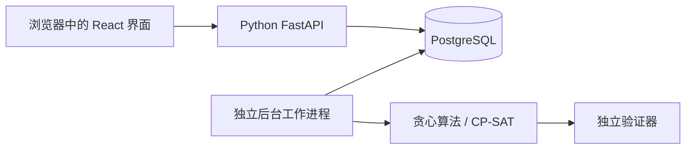

# 学习指南

本项目由用户授权、代理辅助实现。实现期间先完成产品与验证；本指南用于之后系统学习。功能状态见 [实施记录](execution-status.md)，不能把设计要求当作已经实现的能力。

## 产品与主要流程

用户输入任务、剩余工作量、截止日期、依赖和可用时间，检查候选日程后明确启用。错过工作或修改条件后，再检查调整方案。无法满足约束时应解释冲突。

例如：实验报告需要 3 小时，周四截止，但你只有两段各 90 分钟的空闲。允许拆分时可安排两段；要求连续完成时则不能假装有三小时连续空闲。

## 架构阅读顺序

图表示目标架构，各部分实际完成程度以实施记录为准。浏览器负责展示与收集输入；后端决定是否允许操作；数据库是持久状态来源；后台进程承担耗时计算。

## 基础环境

- **Python / uv**：Python 执行后端代码；uv 固定解释器和依赖，并创建项目自己的 `.venv`。替代方案是 pip + venv，但要额外维护依赖锁定。版本来源为 `.python-version`、`pyproject.toml` 和 `uv.lock`。
- **React / TypeScript / Vite**：`.tsx` 文件是在浏览器运行的界面代码，TypeScript 在构建前检查类型，Vite 提供开发服务器和生产构建。这里不需要额外引入服务端渲染框架。
- **PostgreSQL / SQLAlchemy / Alembic**：分别是数据库、Python 数据访问工具和数据库结构迁移工具。迁移把结构变更记录成可执行步骤，不能用“数据库连得上”代替“结构正确”。
- **Docker Compose**：用可重复配置启动本地数据库和身份提供方，避免依赖用户机器上已有的数据库。测试必须使用独立数据库。
- **pytest / Vitest / Playwright**：分别覆盖 Python 行为、界面组件行为和真实浏览器流程。模拟网络失败只能证明对应错误处理，不能证明外部服务集成成功。

## 第一个增量：基础连接

1. 用户能力：检查工作台是否成功连接后端，并在连接失败后重试。
2. 架构位置：浏览器通过同源代理访问后端 readiness 接口；readiness 检查数据库与迁移。
3. 决策：区分 liveness（进程仍能响应）和 readiness（依赖满足，可以处理工作）。数据库中断不应该让 liveness 谎报进程已死。
4. 替代：只提供一个健康接口更简单，但无法区分重启应用和修复数据库这两类问题。
5. 验证：见 [证据索引](evidence-index.md)。只有记录实际执行结果后才算通过。
6. 阅读入口：Python 后端 `services/planner/src/planner/app.py`；TypeScript 界面 `apps/web/src/App.tsx`。
7. 后续练习：停掉数据库，分别访问两种健康接口，解释为什么响应不同。

## 复现与已知限制

命令集中在根目录 README；`--frozen` 要求使用锁文件，避免安装时悄悄更新依赖。学习时先跑通命令，再按“产品 → 架构 → 一次请求 → 工具 → 决策 → 失败恢复”的顺序阅读。

GPU 可用于适合的后续实验，但基础约束求解与小型路由分类器不应为了使用 GPU 而增加模型复杂度。

## 时间、约束与独立验证

- 用户输入保留原始时长和本地时间意图，计算使用 UTC。15 分钟网格只在调度时使用：31 分钟需要 3 个槽，但存储仍是 31 分钟。
- 可用时间向内取整，已有忙碌时间向外取整，避免日程侵占边界。日期截止表示该日期结束后的本地午夜；不是该天开始。
- 夏令时会产生不存在或重复的本地时间。前者拒绝，后者要求明确偏移选择。14 个本地日不一定等于 336 小时。
- 每份快照明确自己的槽原点。旧计划的槽数字不能直接搬进另一日的快照，跨日比较应使用绝对 UTC 时间。
- Python/Pydantic 的不可变契约在 API、后台和算法之间传递数据。`TaskSpec.required_slots` 是派生值，外部请求不能单独指定。
- 独立验证器重新检查工作量、重叠、依赖、可用时间、截止和锁定。求解器“说成功”不足以启用结果。

阅读入口：`domain/time_rules.py`、`solver/validator.py`（均在 `services/planner/src/planner/`）。验证见 [Task 2](evidence/task-2-domain.md) 和 [算法报告](evidence/task-4-5-solver.md)。练习：手算 09:07–09:22 的忙碌时间为什么挡住 09:00–09:30。

## 贪心与 CP-SAT

- 贪心方法按依赖、截止、优先级依次找位置，速度快，但失败并不证明无解。
- CP-SAT 是约束优化工具。可选区间表达工作块，互斥约束防止重叠，前后关系表达依赖。时间用整数槽使搜索范围有限。
- 评分只比较软偏好：未来任务缺口、改动幅度、偏好时段匹配、碎片和完成延迟。不能用高评分抵消硬约束违规。
- OPTIMAL、FEASIBLE、INFEASIBLE、UNKNOWN、MODEL_INVALID 是不同结论。搜索超时可能只是没找到结果。
- 复杂模型有明确资源界限，整份输入被拒绝时给出资源错误；不能为了省计算悄悄缩减允许的工作块数量。
- 用独立穷举器枚举很小的实例，与 CP 的可行性和最佳评分对照。大实例只记录已找到的结果及计算预算，不宣称全局最优。

阅读入口：`solver/greedy.py`、`solver/cp_sat.py`。替代方案是全部使用简单规则：更容易实现，但复杂依赖或碎片时间可能错失可行方案。练习：构造一个先放灵活任务、导致紧迫任务排不下的例子。

## 登录、所有权和安全重试

- OIDC 将身份验证交给本地 Keycloak；应用验证签名、发行方、受众、过期时间和 nonce。PKCE 把登录开始与换取结果的请求绑定。
- 浏览器持有不透明的 HttpOnly 会话 cookie，服务端保存会话；每次修改还要求 CSRF token。业务接口没有测试用的免登录后门。
- 所有任务查询都按所有者过滤，依赖关系的数据库外键同时包含 owner_id 和 task_id。数据库约束是接口校验之外的第二层保护。
- 每个用户有一个规划版本号。修改必须携带读到的版本号；冲突返回 409，不能覆盖新状态。
- Idempotency-Key 标识一次逻辑操作。网络超时后的同一内容重试返回原结果，不再次创建任务。相同 key 配不同内容也被拒绝。
- 可用时间列表和它的版本号必须来自同一个读取快照。实现中使用 PostgreSQL REPEATABLE READ；前端提交也使用该列表自己的版本号。这是代码审查复现后补上的实际并发缺陷。

阅读入口：`api/auth.py`、`domain/commands.py`。验证包括真实身份提供方登录、两个用户隔离、数据库外键、CSRF 和交错事务；见 [Task 3](evidence/task-3-inputs.md)。练习：打开两个页面修改同一份条件，解释第二次保存为什么应得到冲突。

## 后台计算与用户确认

- API 快速持久化请求，独立 worker 领取任务，在可终止的子进程中执行求解。CPU 密集计算不运行在 HTTP 事件循环中。
- 租约规定某个 worker 暂时拥有任务；fencing token 每次领取递增。旧进程即使迟到提交，也不能覆盖接管者的结果。
- 高频输入修改会合并为每位用户的一份待计算请求，保留最初排队时间。轮换用户避免单个用户占满计算槽。
- 启用日程时重新检查版本和当前时间；计算时有效的时间块可能已经过去。启用本地计划与同步远端日历是两种状态。
- 前端显示失败候选的具体诊断，即使该候选不能成为可启用的 proposal。保留错误输入，便于修正后重试。

阅读入口：`jobs/dispatcher.py`、`domain/plans.py`。后台故障测试和浏览器证据以 [证据索引](evidence-index.md) 为准。练习：停止 worker 后提交任务，再重启，观察排队与计算状态。

## 已实现的前端流程

React/TypeScript 在浏览器执行；TanStack Query 管理接口查询与重新获取，OpenAPI 生成器把 Python 接口结构转换成 TypeScript 类型。修改后必须运行 `npm run api:generate`，`npm run api:check` 检查接口漂移。

使用 UTC 标注的表单创建任务、可用时间和固定事件；可指定依赖，查看日程块后点击启用。日期、剩余分钟、拆分规则均可见。真实 Chromium 测试覆盖两个用户与生成启用流程，组件测试覆盖错误恢复和并发版本组合。浏览器测试不能替代后端事务与独立算法测试。

阅读入口：`apps/web/src/features/Workspace.tsx` 与 `apps/web/src/features/proposals/PlanPanel.tsx`。当前版本仍有后续计划中的改进；不要把可运行的 R1 路径等同于整份计划完成。

## 调整日程时，哪些事实可以改变

用户现在可以记录进度、纠正记录、锁定或移动时间块，并先预览再应用假设。例如：原计划读书 60 分钟，实际读了 20 分钟，但发现内容更难，预计还需要 70 分钟。系统保存“观察到 20 分钟”和“剩余估计 70 分钟”两项事实，不擅自计算成 40 分钟。

- 工作日志只追加，纠正记录指向原记录。旧记录保留，便于解释估计如何变化。直接覆盖旧值更简单，但会失去历史。
- 已启用方案是历史快照；锁定和正在进行的工作是新的规划输入。后台重算不能改写旧方案。
- 时间块匹配比较实际 UTC 区间，尽量保留身份。稳定身份同时支持“哪里变了”的界面和远端日历去重。
- What-if 使用独立持久化任务，能共用后台计算池；只有明确点击应用才修改真实输入，之后仍需另行启用新方案。

阅读入口：Python 后端的 `domain/work_logs.py` 与 `domain/what_ifs.py`；React/TypeScript 的 `features/progress/ProgressPanel.tsx` 在浏览器显示操作。验证见 [Task 8](evidence/task-8-adaptation.md) 和 [R2 浏览器](evidence/r2-ui.md)。练习：预览增加一小时空闲时间，刷新另一页面，解释为什么真实可用时间尚未变化。

## 自然语言输入是待审核草稿

现在可以输入一句任务描述，查看字段引用了哪段原文，再确认或补充后批量保存。每周规则区分“尽量避开周日”“周日不能工作”和“截止日期不能在周日”。它们分别影响软评分、可用时段和任务录入校验。

- 模型输出先经过 Pydantic 结构校验、来源范围检查、依赖检查及人工确认要求，再进入现有事务接口。自然语言解析不能直接发布日程。
- 未知字段保持未知；模糊截止日期要求用户填写或明确选择没有截止日期。引用原文只能证明来源，不能证明理解正确。
- 本地演示解析器不调用付费模型。真实适配器有调用前预算预留、超时和保守费用记账；没有获准预算时保持关闭。
- 评估按场景家族分组，近似改写不能跨开发、验证、测试集。报告保留解析失败和缺失字段的分母。
- 当前冻结的本地解析器在最终 30 个合成样本中关键字段匹配为 87/90；这不是实时大模型准确率，更不是自然用户输入准确率。独立人工参考答案审核尚未完成。

阅读入口：运行在独立 Python worker 中的 `ai/interpret.py`，以及处理事务接受的 `ai/accept.py`；React 审核表单位于 `features/interpretation/InterpretationPanel.tsx`。证据见 [AI 评估](evidence/ai-evaluation.md) 与 [每周规则](evidence/weekday-rules.md)。练习：比较“周日尽量不工作”和“周日不能工作”，说明为什么不能互换。

## 日历同步为什么需要恢复机制

用户可以导出 ICS 文件，也可以连接本地持久化日历模拟器。ICS 是一次性副本；连接日历则持续记录远端版本与发布进度。本地启用成功不表示远端已经同步完成。

- 同步先暂存所有分页，完整成功后一起提交镜像和游标。第二页失败时保留旧镜像，避免错误地删除未读到的事件。
- 每个时间块使用稳定远端 ID。创建成功但响应丢失时，重试先核对远端对象，不生成重复事件。
- ETag 是远端版本标识。条件写入防止覆盖用户刚刚手动移动的事件；冲突后重新读取实际区间，并让用户选择恢复或接受变化。
- 远端手动移动到 11:07 这类非网格时间时，保留原始事实并显示冲突，不能把额外取整的时间当作已经完成的工作。
- Google 授权与登录授权分开；刷新凭据加密保存。模拟器测试证明本地协议处理，真实 Google 权限、服务配额与运行可靠性仍需单独验证。

阅读入口：Python worker 中的 `calendar/sync.py` 和 `calendar/publish.py`；设计取舍见 [ADR 0002](adr/0002-calendar-consistency.md)，故障与修复见 [日历证据](evidence/task-11-12-calendar.md)。练习：解释为什么 HTTP 请求超时不能推断远端创建失败。
