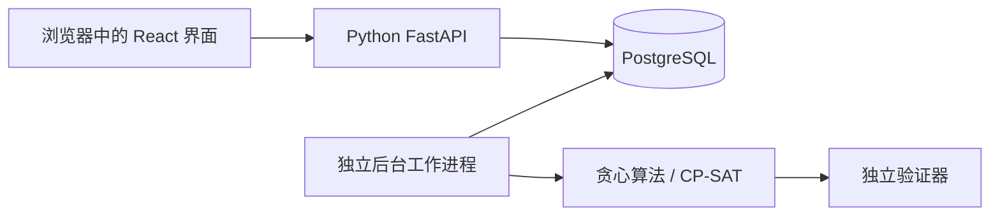

# 学习指南

本项目由用户授权、代理辅助实现。实现期间先完成产品与验证；本指南用于之后系统学习。功能状态见 [实施记录](execution-status.md)，不能把设计要求当作已经实现的能力。

## 产品与主要流程

用户输入任务、剩余工作量、截止日期、依赖和可用时间，检查候选日程后明确启用。错过工作或修改条件后，再检查调整方案。无法满足约束时应解释冲突。

例如：实验报告需要 3 小时，周四截止，但你只有两段各 90 分钟的空闲。允许拆分时可安排两段；要求连续完成时则不能假装有三小时连续空闲。

## 架构阅读顺序

图表示目标架构，各部分实际完成程度以实施记录为准。浏览器负责展示与收集输入；后端决定是否允许操作；数据库是持久状态来源；后台进程承担耗时计算。

## 基础环境

- **Python / uv**：Python 执行后端代码；uv 固定解释器和依赖，并创建项目自己的 `.venv`。替代方案是 pip + venv，但要额外维护依赖锁定。版本来源为 `.python-version`、`pyproject.toml` 和 `uv.lock`。
- **React / TypeScript / Vite**：`.tsx` 文件是在浏览器运行的界面代码，TypeScript 在构建前检查类型，Vite 提供开发服务器和生产构建。这里不需要额外引入服务端渲染框架。
- **PostgreSQL / SQLAlchemy / Alembic**：分别是数据库、Python 数据访问工具和数据库结构迁移工具。迁移把结构变更记录成可执行步骤，不能用“数据库连得上”代替“结构正确”。
- **Docker Compose**：用可重复配置启动本地数据库和身份提供方，避免依赖用户机器上已有的数据库。测试必须使用独立数据库。
- **pytest / Vitest / Playwright**：分别覆盖 Python 行为、界面组件行为和真实浏览器流程。模拟网络失败只能证明对应错误处理，不能证明外部服务集成成功。

## 第一个增量：基础连接

1. 用户能力：检查工作台是否成功连接后端，并在连接失败后重试。
2. 架构位置：浏览器通过同源代理访问后端 readiness 接口；readiness 检查数据库与迁移。
3. 决策：区分 liveness（进程仍能响应）和 readiness（依赖满足，可以处理工作）。数据库中断不应该让 liveness 谎报进程已死。
4. 替代：只提供一个健康接口更简单，但无法区分重启应用和修复数据库这两类问题。
5. 验证：见 [证据索引](evidence-index.md)。只有记录实际执行结果后才算通过。
6. 阅读入口：Python 后端 `services/planner/src/planner/app.py`；TypeScript 界面 `apps/web/src/App.tsx`。
7. 后续练习：停掉数据库，分别访问两种健康接口，解释为什么响应不同。

## 复现与已知限制

命令集中在根目录 README；`--frozen` 要求使用锁文件，避免安装时悄悄更新依赖。学习时先跑通命令，再按“产品 → 架构 → 一次请求 → 工具 → 决策 → 失败恢复”的顺序阅读。

GPU 可用于适合的后续实验，但基础约束求解与小型路由分类器不应为了使用 GPU 而增加模型复杂度。
