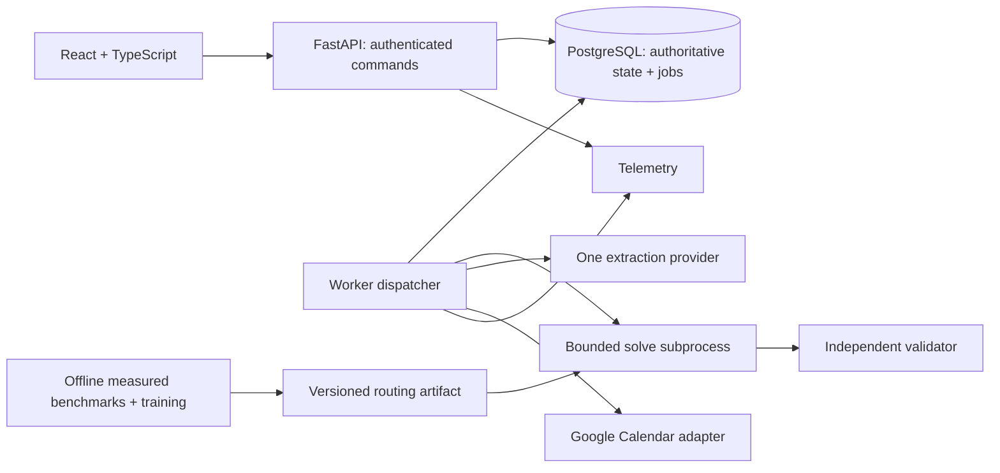

# Adaptive Planner Implementation Plan

> **For agentic workers:** Use the executing-plans workflow, if available, to implement this document task by task. Steps use checkboxes for tracking. Delegation is optional and subject to the user's instructions; this plan does not require parallel agents.

**Goal:** Build a full-stack planning application that converts reviewed natural-language requests into valid schedules, adapts safely to change, synchronizes a calendar, and measures whether learned algorithm selection improves on simpler policies.

**Architecture:** A Python/FastAPI modular application and separate worker share PostgreSQL and domain contracts. Deterministic heuristics and OR-Tools produce candidates checked by an independent validator. LLMs propose input interpretations; people approve changes. A small offline-trained model can choose a scheduling strategy only after a baseline-controlled evaluation.

**Tech stack:** Python 3.12, FastAPI, Pydantic, SQLAlchemy, Alembic, PostgreSQL, OR-Tools CP-SAT, scikit-learn, React, TypeScript, Vite, TanStack Query, pytest, Hypothesis, Playwright, Docker, GitHub Actions, OpenTelemetry, AWS ECS/RDS/S3/ECR, Terraform.

**Spec:** This document is the authoritative revised design and implementation plan. It incorporates [the original blueprint](../adaptive-planner-blueprint.md), preserving its product thesis while strengthening market-relevant delivery and correctness requirements. Where they differ, this document governs. The original blueprint remains unchanged.

**Date:** 2026-09-24. **Status:** implementation started 2026-09-25; no release gate complete. See [execution status](docs/execution-status.md) and [evidence index](docs/evidence-index.md) for implemented versus verified capabilities.

## 1. Global constraints and execution authority

- Target SWE and AI-SWE first. ML is a bounded experiment; successful model promotion is not required to complete the experiment.
- One personal workspace per user, two isolated synthetic demo users, one Google Calendar adapter, one LLM provider adapter.
- Rolling 14-local-calendar-day window, up to 200 active tasks, 15-minute scheduling slots. These are proposed limits to validate, not demonstrated capacity.
- Default configurable work blocks: 30–180 minutes. Short final remainders require explicit permission and remain at least one slot.
- No Kafka, Kubernetes, Redis, vector database, multi-agent runtime, foundation-model training, organizations, billing or native mobile app in the required release.
- Synthetic data only in source control, demos and published experiments. Real-calendar testing uses a dedicated synthetic calendar.
- No existing CaseFlow credentials, cloud budget or model-call authority is assumed to transfer. Local fixtures, mocks, implementation and tests can proceed independently.
- Specify AWS delivery in code; execute paid resources/live calls only with project credentials and a recorded spending allowance. Missing external access leaves the corresponding gate open, not falsely passed.
- No approval or external calendar publication by an LLM. Users activate proposals; what-if results cannot alter the active plan.
- Do not claim exactly-once external writes, human productivity gains, production adoption, or universal security from controlled tests.
- Preserve the user's learn-while-build preference: explain unfamiliar tools and mechanisms briefly; show rerunnable commands and one or two relevant files after each task.
- This turn creates planning documentation only. The future agent implements the application; no code or infrastructure is represented as already created.

## 2. Why this is a stronger portfolio project

The historical workbook `F:/Me/Project/Layne_Xia_Project_Portfolio_with_Recruiter_Wants.xlsx`, SWE Wants A9:I54, summarizes 167 selected SWE roles. Its counts are distinct-JD mentions within that sample, not population estimates. Categories overlap. Skill Audit A8:H11 and A35:H35 describe earlier resume evidence, not a fresh resume audit.

| Market signal | Roles mentioning | Required project proof |
| --- | ---: | --- |
| Build and ship production systems | 117 | Usable browser journey, deployed artifact, release evidence |
| Python | 78 | Substantial API/domain/worker ownership |
| Java | 36 | Covered by CaseFlow; do not force a second backend into this project |
| System architecture/design responsibility | 35 | Explicit contracts, alternatives, failure scenarios and ADRs |
| Databases | 28 | Relational integrity, migrations and concurrent transactions |
| Algorithms/data structures | 26 | DAG validation, greedy baseline, interval constraints, complexity discussion |
| Performance improvement | 24 | Both SQL and scheduling measurements, before/after |
| SQL | 22 | Mandatory query plans, indexing, pagination and queue contention study |
| Testing/quality | 21 | Property tests, integration/fault/browser tests and negative controls |
| React / TypeScript | 18 / 15 | Complete typed UI with accessible failure/conflict states |
| AWS | 17 | Terraform, ECS delivery, rollback, backup/restore and teardown |
| Agentic AI / LLMs | 13 / 11 | Evaluated interpretation and bounded actions, not an unsupported agent label |

The additional ML experiment supplies feature engineering, baseline comparison, leakage prevention, model versioning and serving parity. It is a project-specific differentiator, not evidence that every SWE employer requests ML.

Retain the planner's Python/optimization identity. CaseFlow is the complementary Java/enterprise-workflow example. Treat any claims about completed CaseFlow work as requiring that project's own evidence.

## 3. Product contract

Example: a student has fixed classes, an exam, a lab deadline and a newly arrived assessment. The application allocates feasible work, shows a missed session's effect, preserves completed/locked work, and explains when there is insufficient capacity. It never silently postpones a deadline or assumes more working hours.

Required flows:
1. Sign in; create tasks, deadlines, remaining effort, dependencies, availability and preferences.
2. Request a plan; inspect candidate quality, conflicts, changed blocks and solver status; activate explicitly.
3. Log partial work, complete a task, miss a block or change availability; inspect a revised proposal.
4. Move/lock future blocks and preserve those commitments during replan.
5. Compare a what-if revision without changing active state. Explicitly apply its input changes, then compute and activate a current proposal.
6. Review a natural-language extraction proposal and resolve ambiguity before accepting it.
7. Export ICS; connect a dedicated Google calendar; publish activated blocks, import external busy periods and recover failed synchronization.
8. Inspect an evidence page showing implemented releases, metrics, raw artifacts and limitations.

Primary screens: task/constraint editor, agenda, proposal comparison, conflict resolution, extraction review, integration status, settings and evidence. An in-app agenda is sufficient for R1; live provider integration arrives in R2.

Keep loading/empty/error/offline/conflict states explicit. Show separate solve and calendar-sync status. Keyboard alternatives to dragging, labeled fields, focus on validation errors, visible timezone/rounding, responsive layouts and retained form input are mandatory.

## 4. Releases and completion gates

| Release | Product | Required gate |
| --- | --- | --- |
| R1: correct planner | Structured inputs, auth/isolation, greedy and CP-SAT, validator, revisions, durable jobs, agenda | Fresh checkout runs two-user scenario; properties/tiny-instance checks pass; stale activation fails |
| R2: adaptive AI/integration | Work logs, locks/diffs/what-if, interpreted inputs, ICS, Google adapter | Missed-work/conflict/manual-fallback demos; AI results reported; provider failure recovery verified |
| R3: measured engineering/ML | SQL study, fair queue/load tests, baselines, trained router/shadow/rollback | SQL evidence mandatory; ML experiment reproducible even if model is not promoted |
| R4: portfolio delivery | AWS/Terraform, CI, restore/rollback, dashboards, usability and demos | Actual executed evidence linked per capability; externally blocked gates remain open |

Introduce unit/integration tests, telemetry and local CI commands from R1. Hosted CI starts as soon as an authorized repository exists. Do not postpone all quality/deployment work to the final release.

Expected planning range: 240–360 focused hours, revisited after R1. This is an estimate for one learner, not a promise. Ship and document each release; do not leave a half-working product waiting for optional ML superiority.

## 5. Architecture, ownership and repository



One backend codebase, one migration sequence, separate API and worker processes. No domain microservices. The API alone accepts user commands; worker completion invokes the same domain transition services. CPU solving never runs on the HTTP event loop. Model calls and calendar calls have separate bounded worker pools and timeouts.

Use PostgreSQL as the job store and durable outbound-operation log. Queue locks are short; no transaction remains open during solving or network calls. SKIP LOCKED is for queue claims, not general read consistency [S1].

Planned paths (not existing files):

```text
apps/web/src/{api,features,components}/
services/planner/src/planner/
  app.py, cli.py, settings.py
  domain/{contracts,time_rules,task_rules,revisions,commands,plans,work_logs}.py
  db/{models,session,repositories,queries}.py
  api/{auth,routes,errors}.py
  solver/{greedy,cp_sat,validator,objective,diagnostics,block_matching}.py
  jobs/{dispatcher,leases,coalescing,handlers,subprocesses}.py
  ai/{provider,schema,interpret,accept,evaluate}.py
  calendar/{provider,google,sync,publish,reconcile,ics}.py
  ml/{features,router,manifest}.py
  observability/{logging,tracing,metrics}.py
db/migrations/versions/
tests/{unit,property,integration,fault,contract,e2e,load}/
tests/fixtures/
benchmarks/{generate,run,sql,analyze}.py
training/{build_dataset,train,evaluate,promote}.py
evals/{data,run,score}/
infra/terraform/{bootstrap,modules,environments/demo}/
infra/observability/
scripts/{dev,verify,seed}.ps1
docs/{adr,evidence,teaching-guide.md,interview-prep.md,claim-to-evidence.md}
.github/workflows/{checks,release,evaluate}.yml
compose.yaml, pyproject.toml, uv.lock, package-lock.json, README.md
```

Python package root uses a workspace dependency with tests installed from the root. Use uv, npm workspaces and committed locks; lock compatible patch versions in Task 1. Do not rely on globally installed packages. Use a supported PostgreSQL major common to local Docker and chosen RDS region. Exact pins are a Task 1 deliverable, not invented compatibility claims.

## 6. Authoritative types and function boundaries

Define immutable Pydantic contracts in `domain/contracts.py`; serialization is JSON with timezone-aware ISO instants. Use UUIDs externally and integer slot indices only inside solver snapshots.

| Type | Required content |
| --- | --- |
| TaskSpec | id, owner_id, title, state, release_at, deadline kind/value/timezone, remaining_minutes, derived required_slots, priority 1–5, splittable, min/max block slots, short_final_allowed |
| InputSnapshot | id/hash, owner_id, planning_revision, reference_now, timezone, horizon, tasks, dependencies, availability, derived busy_slot_ranges, fixed/locked/in-progress blocks, soft preferred windows, prior active candidate reference, objective_version |
| Block | stable id, task_id, UTC start/end, slot interval, source, locked flag |
| Candidate | snapshot hash/revision, status, source policy, blocks, constraint report, score components, solver metadata |
| Violation | stable code, related ids, structured facts; no unsupported narrative |
| Proposal | immutable candidate, current/superseded state, activation/publication metadata |
| ExtractionProposal | schema version, reference clock/timezone, fields with explicit/inferred/unknown labels and evidence spans, unresolved questions |
| FeatureVector | versioned ordered names and finite values computable before CP-SAT |

Public module contracts:

```python
normalize_time_inputs(raw: dict, now: datetime) -> InputSnapshot
validate_tasks(snapshot: InputSnapshot) -> list[Violation]
greedy_schedule(snapshot: InputSnapshot) -> Candidate
solve_cp_sat(snapshot: InputSnapshot, budget_ms: int, seed: int) -> Candidate
validate_candidate(snapshot: InputSnapshot, candidate: Candidate) -> list[Violation]
score_candidate(snapshot: InputSnapshot, candidate: Candidate) -> Score
diff_plans(old: Candidate, new: Candidate) -> PlanDiff
extract_features(snapshot: InputSnapshot, greedy: Candidate) -> FeatureVector
route_candidate(features: FeatureVector, manifest: ModelManifest) -> RoutingDecision
```

`Score` has bounded component values, total penalty and quality. `PlanDiff` has retained/moved/added/removed blocks and reason codes. `ModelManifest` includes feature/data/code hashes, policy parameters and artifact digest. `RoutingDecision` is ACCEPT_VALID_GREEDY or RUN_CP_SAT with model/version metadata. Define these types in the same contracts module before consuming them.

Task states are TODO, IN_PROGRESS, DONE and CANCELLED. In this enum, TODO is a real task state, not an unfinished specification. Solver slot ranges are half-open [start, end). TaskSpec.required_slots is derived during normalization; API callers cannot independently set it. InputSnapshot.busy_slot_ranges is the normalized union of fixed external occupancy, with task-owned protected blocks retained separately to avoid counting them twice.

Adapters expose typed `CalendarPage`, `CalendarEvent`, `CalendarWriteResult`, `ProviderError` and `LLMResult` in their provider modules. ProviderError distinguishes retryable, ambiguous-write, authentication-required and permanent-validation failure. Do not flatten them into a generic retry.

## 7. Time semantics and supported scheduling envelope

All calculations receive a fixed reference clock; no hidden `datetime.now()` calls in pure domain/solver logic. Store UTC instants and original IANA timezone/local intent. The horizon begins at the first available slot at/after now and ends at local midnight 14 calendar dates after the current local date. DST can change elapsed horizon length; enumerate actual instants.

Use a 15-minute UTC-aligned slot grid. Availability is rounded inward; fixed busy intervals outward. A 09:07–09:22 commitment blocks 09:00–09:30 in the applicable offset. Round release times/start-now upward and timestamp deadlines downward for slot feasibility. Show original values and rounding loss in the UI. A plan deemed infeasible under this grid is not a proof that a continuous-time schedule is impossible.

Date-only deadline means next local midnight, exclusive. A timestamp deadline is an inclusive upper bound on task end. Reject nonexistent local times with a correction prompt. Repeated-hour inputs require an explicit offset/fold selection. A timezone change preserves absolute fixed events and timestamp deadlines; date-only task deadlines retain their entered calendar date in the new planning timezone after an explicit preview/confirmation.

Effort: persist user-entered remaining minutes; derive ceil(minutes/15) solver slots without repeatedly rounding the stored value. Work logs record observed minutes; a log requires an explicit new remaining estimate or task completion. Elapsed time alone never marks DONE. Corrections are append-only.

In-progress work occupies a declared protected interval through an explicit expected end; never leave an unbounded open interval. Its future reserved portion counts toward remaining planned effort. Completed blocks are historical, excluded from future remaining effort and never rescheduled. Locked future work counts toward its task's remaining requirement; if locks exceed remaining work, produce a conflict requiring explicit correction.

For tasks due within the horizon, all rounded remaining work must fit by deadline. Later/no-deadline tasks may be partially scheduled and visibly incomplete. A predecessor must complete before any successor work; a beyond-horizon predecessor not completed in the candidate blocks successor allocation. DONE predecessors are satisfied; CANCELLED predecessors require dependency removal/resolution. Reject cycles and cross-owner edges.

Unsplittable work uses one contiguous block. Splittable work uses ordered nonoverlapping blocks with declared min/max lengths and optional final short remainder. Do not add an undocumented maximum-block constraint to make the solver faster. Reject unsupported inputs explicitly if implementation resource limits require a narrower envelope.

New fixed events can conflict with locked/in-progress work. Report the conflict; neither source silently wins. A past deadline remains unresolved. What-if changes may relax only named constraints after explicit user selection.

## 8. Scheduling algorithms, score and validation

Greedy baseline: topologically eligible tasks ordered by in-horizon deadline, descending priority, release time, then stable ID. Place into earliest eligible windows, honoring locks and splitting rules. A failed greedy placement means only heuristic failure.

CP-SAT: optional interval variables for task segments, no-overlap against fixed intervals, release/deadline bounds, precedence and workload sums. Full completion is required for in-horizon tasks; later tasks have optional allocated work and an explicit completion indicator used by dependency rules. Order segments to break equivalent permutations. Use the validated greedy candidate as a warm-start hint where supported. Document variable growth and measure it at 20/50/100/200 tasks.

Return OPTIMAL, FEASIBLE, INFEASIBLE, UNKNOWN and MODEL_INVALID distinctly. A time limit is not proof of infeasibility [S2]. Default CP search budget 2,000 ms; subprocess wall limit 5 seconds including overhead. These are caps, not latency promises. If CP yields nothing, use a validated greedy candidate if one exists; otherwise keep the previous plan historical and mark unresolved/conflicted.

Independent validator must not reuse CP model-building constraint predicates. Recompute ownership, workload, rounding, overlap, availability, release/deadline, dependency and locks directly from normalized input and result. Use hand-authored fixtures and exhaustive tiny enumerations to reduce shared-normalization blind spots.

Versioned objective v1 minimizes integer-weighted soft penalties; hard constraints never become score terms. Compute these components in [0,1] with declared zero-denominator behavior:
- Future-work deficit: unallocated weighted later-task effort / requested weighted later-task effort; zero if none.
- Disruption: displaced/unallocated slots of previously planned unlocked future work / that reference work; zero for first plan. Double near-term reference weight for the next 24 hours.
- Preference mismatch: allocated slots outside soft preferred windows / allocated slots; zero when no soft preference or no allocation.
- Fragmentation: excess blocks above each scheduled task's minimum needed under max-block length / maximum possible excess at one-slot granularity; zero if denominator zero.
- Completion delay: priority-weighted completion position within each scheduled task's allowed horizon interval, clipped to [0,1]; unscheduled optional tasks already penalized by deficit.

Weights: 30/25/20/15/10 in that order. Implement bounded integer scaling for CP-SAT and evaluate every policy with the same reference scorer. Quality = 1 - weighted penalty/100. Freeze definitions/weights before held-out evaluation. They encode preferences, not human productivity.

Block IDs are stable after deterministic matching by task and interval overlap, then start/id tie-break. Locked IDs must remain exact. Structured explanations identify changed inputs and failed constraints; any optional LLM paraphrase may not add a cause.

Diagnostics: cheap necessary-condition checks first (cycles, total capacity before deadline, impossible unsplittable interval). Bounded diagnostic solves may identify a sufficient conflict set. Do not call it minimal/unique without proof. Distinguish input errors, proven model infeasibility and unknown results.

## 9. Persistence, commands and API

Tables: identities, tasks, dependency_edges, availability_rules, fixed_events, work_logs/corrections, user_planning_state, immutable_snapshots, proposals, proposal_blocks, jobs/attempts, command_receipts, owner_dispatch_state, calendar_connections, event_mirrors, publication_operations, block_event_mappings, extraction_proposals, model_versions and audit_events.

Every user-owned relationship uses an owner-inclusive foreign key, including task dependencies and proposal blocks. Identity is unique by OIDC issuer + subject. Snapshot hashes include normalized inputs and objective version. A single user_planning_state row owns current revision and active proposal pointer. Application audit is append-only; do not claim protection from privileged DB administrators.

Each accepted planning-input command checks expected revision and idempotency. Within one transaction: lock user_planning_state, validate command, mutate data, increment revision, write audit/receipt and coalesce/enqueue work. Stale revisions return 409. Same scoped key+hash returns original response after current authorization; same key+different hash returns 409; racing in-progress requests get a retryable conflict. Retain receipts seven days; permanent invariants still protect state after expiry.

Scope keys by owner, operation and key; hash canonical body/resource/revision. Error responses use stable code, message, field/related IDs, retryability and correlation ID. Do not expose other users' resource existence.

| API group under /api/v1 | Contract |
| --- | --- |
| GET /me | Identity, timezone, revision and capabilities |
| GET/POST /tasks, GET/PATCH /tasks/{id}, POST /tasks/{id}/cancel | Owner-scoped CRUD with expected revision |
| POST/DELETE /tasks/{id}/dependencies | DAG and owner validation |
| PUT /availability, POST/PATCH /fixed-events | Explicit local-time semantics |
| POST /tasks/{id}/work-logs, /work-logs/{id}/corrections | Append observations, set remaining estimate |
| POST /replans, GET /jobs/{id} | Durable asynchronous request/status |
| GET /proposals/{id}, GET /proposals/{id}/diff | Immutable candidate and structured changes |
| POST /proposals/{id}/activate | Current-revision/current-time validation, atomic publication intent |
| POST /blocks/{id}/lock, /move | Revisioned input change; no silent direct solver mutation |
| POST /what-ifs, POST /what-ifs/{id}/apply | Isolated hypothetical inputs; explicit compare-and-swap application |
| POST /interpretations, /interpretations/{id}/accept | Proposal only; reviewed batch acceptance |
| GET /exports/calendar.ics | Authorized export with stable UIDs |
| POST /calendar/connect, GET /calendar/callback, POST /calendar/disconnect | Google OAuth flow, separate from login |
| POST /calendar/sync, GET /calendar/status, POST /calendar/conflicts/{id}/resolve | Recovery and explicit conflict resolution |
| GET /evidence | Public-safe static release evidence, never user data |

Generate and check the TypeScript client from committed OpenAPI. List tasks by stable cursor (created_at,id), with filters bound into cursor and upper-bound watermark. Document that this prevents newly inserted records entering an existing scan but does not promise snapshot semantics across edits/deletes. Reject cursor/filter mismatch.

## 10. Replanning, fair work scheduling and recovery

Job lifecycle: QUEUED -> RUNNING -> SUCCEEDED, SUPERSEDED, CANCELLED or FAILED. Retryable failures enter RETRY_WAIT before QUEUED. Claims increment fencing token and establish lease; all finalization and heartbeat updates require matching token. Initial lease 30 seconds, heartbeat every 5, maximum five transient attempts with exponential jittered delays capped at 60 seconds. Permanent validation/authorization failures do not retry.

Store one coalescible pending replan per owner. On input change, keep the oldest pending enqueue time for fairness and replace desired revision; mark a running older revision obsolete. Dispatcher captures one immutable snapshot transactionally. Never mutate inputs under an executing solve.

Fairness policy: one active CPU solve per owner. Pick eligible owners by oldest last_dispatch_at, then pending age and owner ID, locking owner_dispatch_state with SKIP LOCKED. Atomically claim owner and job. A busy user cannot occupy all CPU slots. Separate bounded pools for solve, LLM and calendar I/O; document configured sizes in evidence. Default local solve pool 2, I/O pool 4; adjust to measured host capacity.

Coalescing debounce 300 ms; explicit Generate bypasses debounce. A pending revision becomes eligible within two seconds even amid continuous edits; do not keep pushing eligibility forever. On observing a stale revision, terminate its child solve within one second and enqueue latest. Repeated edits may still prevent a current result; display 'waiting for edits to settle' and offer explicit Generate. No claim of bounded completion under infinite input changes.

Activation locks user_planning_state, verifies proposal revision/hash and revalidates against current time and imported calendar revision. A plan computed before time advanced may now contain past work; reject and replan rather than activating it. Atomic transaction selects active proposal, audit and outbound publication operations. Calendar completion is a separate state.

Crash tests: before/after command commit; after claim; during subprocess; lease expiry and takeover; old worker finalization; after result commit/before acknowledgment; mid-publication. Reconciliation finds expired leases, orphan pending owners, stuck retries and remote operations lacking local confirmation. SIGTERM stops claims, bounds in-flight completion and releases or expires leases safely.

Fairness load acceptance: with two solve slots and ten continuously queued users, every noncancelled eligible owner gets a dispatch within a complete round after existing in-flight work clears. Record dispatch sequence and job durations. This is a bounded test invariant, not an internet-scale fairness guarantee.

## 11. Calendar synchronization and publication

Begin with local events/ICS. Live integration targets one dedicated synthetic Google calendar explicitly selected by the user. Read external events as busy, modify only events carrying this application's private ownership marker and stored mapping. Ignore transparent/cancelled events as busy. Expand provider recurrence within the window; no recurrence editor.

Full and incremental sync: stage all pages under a sync generation; only apply a completed generation/cursor transactionally. Invalid token causes a mirror rebuild without deleting tasks/history [S3]. Imported effective changes increment planning revision; no-op sync does not. Exclude recognized current app-owned plan events from external busy capacity to avoid double-blocking.

Event identity: deterministic provider-valid ID derived from owner/calendar/stable block ID. Store mapping, etag, last published canonical payload and operation ID. A remote write timeout is ambiguous: read/reconcile before retrying create. Conditional writes detect manual edits [S4]. A mismatched event with the same ID is a conflict, not permission to overwrite.

Manually moved app events become explicit locked commitments after sync. Manual deletions remain conflicts rather than immediate recreation. UI offers restore, accept deletion/remove commitment, or disconnect publication; each is revisioned and audited. A partially published plan displays counts/status and continues recovery; local activation does not mean remote convergence.

Serialize writes per calendar with durable lease; recheck active version before each call. Leases cannot fence an already in-flight remote HTTP call. Detect obsolete writes and reconcile toward current accepted state without overriding manual-edit conflicts. Persist uncertain operations and surface prolonged divergence. Do not claim atomic calendar activation.

OAuth refresh token encrypted with environment key management, short-lived access tokens kept out of logs. Refresh failure marks NEEDS_REAUTH; do not loop. Disconnect stops new operations, revokes/deletes credentials as supported, and asks through the product whether existing app events should remain. No account/resource creation is assumed authorized by this plan.

## 12. Applied AI with explicit uncertainty

One provider behind an injectable interface. Mock mode supports all local workflows. Real requests contain selected user text, explicit reference clock/timezone and schema; calendar descriptions are untrusted data, never instructions. No arbitrary tool execution.

Extract task proposals, duration estimates, deadlines, dependencies, priorities and soft/hard preferences. Field schema: value, explicit/inferred/unknown, supporting input span, requires_confirmation. Guessed durations and ambiguous dates must be reviewed. 'Dislike Friday', 'cannot work Friday' and 'no deadlines Friday' map to different concepts.

Validate type/schema then semantics: dates/units, owner references, dependency DAG, contradictions, supported horizon and limits. Do not convert model confidence into calibrated probability. Reviewed batch acceptance uses expected revision and commits all selected changes together; unresolved critical fields cannot pass acceptance. Forms remain available after model errors.

Limits: text 8,000 characters, at most 20 proposed tasks/request, one active interpretation per owner, 30-second provider timeout, at most one retry on retryable transport/429 within job budget. Reserve configured spend before live calls; reconcile actual usage. Record provider/model/prompt/schema versions, latency, tokens and dated cost assumptions. Unknown cost stays unknown. Default live-call flag false until budget is configured.

Evaluation: 120 examples split 60 development/30 validation/30 final test by scenario family. Manually verify references and label AI-assisted annotation. Freeze splits/prompts before test; grouped variants stay together. Include relative dates, locale ambiguity, conflicting requests, missing duration, adversarial instructions and multiple dependencies.

Report critical-field exact match with denominator, full-proposal correctness, hard/soft classification, invented fields, required clarifications, abstention, schema failures, latency and cost. Proposed target: 95% critical-field accuracy and zero accepted unsupported hard constraints in the named adversarial suite. Show counts and uncertainty; 30 test examples are a small experiment. Failed target leaves interpretation experimental, manual product usable.

## 13. ML routing experiment and stronger baseline gate

Goal: accept a validated greedy plan when its quality is sufficient, otherwise spend compute on CP-SAT. Correctness never depends on a classifier. An invalid/incomplete mandatory-work greedy result bypasses learned acceptance and attempts CP-SAT.

Generate 1,000 base scenarios, grouped 600 train/200 validation/200 final test, with variants/repeats in the same split. Vary counts, slack, dependencies, fragmentation, locks, horizon boundaries and edit magnitude. Reserve unseen generator/parameter combinations for robustness. Labels come from actual algorithm runs and validated scores, not an invented decision rule.

Features include counts, utilization/slack statistics, DAG depth, free-interval statistics, locked fraction, changed-work fraction, and greedy validity/score. Feature computation and greedy time count in total latency. No future CP outcome/runtime features. Fit preprocessing on training data only; use one feature builder in serving and training.

Compare: greedy-only; always CP-SAT; warm-start CP-SAT after greedy; a tuned fixed slack/utilization routing rule; logistic regression; one gradient-boosted model. Freeze the strongest simple policy using validation only. All policies have the same end-to-end resource allowance; explicitly report baseline overhead and subprocess startup.

Target label for valid greedy cases: whether measured reference improvement exceeds the declared quality tolerance. CP timeout without a better validated result is unknown label, not proof greedy is adequate; disclose/exclude unknown labels from supervised fitting and include such cases in final policy evaluation. Tiny exactly solved instances establish optimality; longer time-limited references are only best-known, with their budget stated.

Quality loss uses max(0, reference_quality - policy_quality) on paired valid results. Also report signed differences. Missing/invalid results are counted separately, never dropped into an apparently favorable average. Record feasibility on known-feasible instances, mean loss, worst decile, p50/p95 latency, CPU, escalation and per-family slices.

Promotion requires all of these on untouched final test:
1. No invalid accepted plan; no successful-completion loss on the known-feasible set against the reference execution policy.
2. Mean positive quality loss <= 0.02 against best-known reference; worst-decile loss <= 0.05.
3. At least 20% lower end-to-end p95 than always CP-SAT.
4. At least 10% lower p95 than the validation-selected strongest simple router, with no worse mean quality loss by more than 0.005 and no completion loss.
5. Grouped bootstrap interval for paired mean latency improvement versus that simple router excludes zero; report uncertainty for p95 separately.

These are provisional engineering gates, not predictions of success. Adjust only during development with a documented reason, before test access. A failed gate ships the simple policy and publishes a negative experiment. Do not add a feature store, training service or extra model to chase a result.

Manifest: artifact hash, code/data/split hashes, features/order, objective/solver versions, hyperparameters, label rule, thresholds, environment and evaluation. Load only trusted artifacts. Shadow policy observes decisions without activation, then explicit deployment config enables it; rollback restores simple policy. Budget shadow CP runs so they do not secretly worsen normal latency.

Personal duration prediction is optional post-release and requires suitable consented data, chronological validation and censoring-aware labels. Synthetic effort cannot establish user-behavior accuracy. It is not part of the required implementation.

## 14. Mandatory SQL and performance evidence

Both a SQL study and scheduling benchmarks are required. Do not satisfy this section solely with solver measurements.

SQL study A: owner-scoped active task list and dependency fetch with keyset pagination. Candidate indexes include (owner_id, created_at, id) with active-state predicate, and (owner_id, successor_id) for edges. Capture EXPLAIN (ANALYZE, BUFFERS), query count, p50/p95 and write overhead before/after. Batch dependency queries to avoid N+1.

SQL study B: dispatcher claims with archived jobs and multiple owners/workers. Evaluate ready-job partial indexes and owner dispatch ordering. Measure lock wait, rows scanned, claims/second, oldest pending age and fairness. Do not hold network calls under row locks.

Seed reproducible database fixtures with at least 100 users, up to 200 active tasks each, and 100,000 archived job records. These are aggregate storage tests, not a promise to solve all users concurrently. Keep baseline correct and representative; do not manufacture an absurdly broken comparison. Record small-data results where optimization may not help.

Solver benchmark: 20/50/100/200 tasks, feasible/infeasible/unknown cases, exact tiny-instance comparisons, fixed seeds and repeats. HTTP load runs for ten minutes after warmup at a rate chosen from preliminary capacity and frozen before comparisons. Report queue residence, feature/solver/validation time and total ready-to-inspect latency separately from HTTP 202 latency.

Record hardware/resources, DB/version, commit, workload hashes, arrival rate, concurrency, CPU/RSS, errors, dropped load iterations, timeout counts, fairness and backlog slope. Do not claim sustainable throughput while backlog grows. Narrow the supported envelope if measurements demand it.

## 15. Security, observability and delivery

OIDC verifies issuer/audience/expiry with standard libraries; no custom password storage. Keep browser session/token handling explicit: use a same-origin BFF session with Secure/HttpOnly/SameSite cookies, server-side session storage and CSRF protection on mutations. Local development HTTPS/cookie exceptions are isolated. OIDC state/nonce/PKCE required. Google authorization is a separate connection with its own state binding.

Owner-inclusive DB constraints supplement endpoint authorization. Limit solver processes/memory, text/task sizes and per-owner expensive calls. Do not log raw task/calendar/prompt content, tokens, session IDs or OAuth codes. Use stable operation IDs; avoid per-user/plan IDs as unbounded metric labels.

Telemetry: API rate/error/latency; DB pool and transactions; jobs by state; oldest pending age; stale-solve cancellation; lease loss; solve status/duration; validator rejection; calendar lag/conflicts/retries; model usage/cost/invalid proposals. Trace API -> committed job -> worker -> provider/result using context or span links. Use sampled load traces and complete bounded demo traces.

Runbooks: growing queue, stale leases, provider reauth, divergent calendar, invalid candidate, failed migration/deploy. Each gives symptoms, dashboard/query, safe recovery and verification. Include one incident-style report with root cause and regression test.

AWS reference profile: ECR images; ECS/Fargate API and worker; RDS PostgreSQL; S3 for benchmark/model artifacts; ALB TLS; CloudWatch/OTel; Secrets Manager and KMS; Terraform. Serve built frontend from API for one origin. No Redis, broker or Kubernetes required. Choose sizing/region and estimate cost before live execution; use infrastructure tags and retained-resource inventory. Budget alarms are not spending caps.

GitHub Actions PR workflow runs lint/typecheck, unit/property/contract tests, PostgreSQL integration, browser smoke, image/security scans and Terraform validate. Release builds immutable SHA images, runs an explicit migration task, health-gated deploy, workflow smoke and rollback on failed smoke. ECS failure detection/rollback behavior must be configured, not assumed [S6]. Use CI OIDC to AWS where available.

Migrations use expand/contract so previous image remains compatible. Prove rollback and a separate DB backup/restore rehearsal into an isolated environment. Terraform state bootstrap is documented separately. Never describe restoring an application image as restoring deleted data.

External access missing: finish local images, Terraform validation, mocked adapters, tests and deployment runbook; mark hosted checks/live sync/cloud restore as NOT EXECUTED. User can run those later. The project may have a local release, but cannot claim a completed cloud gate yet.

## 16. Implementation task protocol and command conventions

Run from the new project root. Task 1 establishes these command contracts; none is claimed to work before implementation:

```text
uv sync --frozen --all-extras
docker compose up -d postgres oidc
uv run alembic upgrade head
uv run python -m planner.cli seed-demo
uv run pytest tests/unit tests/property -q
uv run pytest tests/integration tests/fault -q
npm ci
npm run typecheck --workspace apps/web
npm run test --workspace apps/web -- --run
npm run test:e2e --workspace apps/web
uv run python -m benchmarks.run --manifest benchmarks/manifests/smoke.json
```

Each task below owns an independently reviewable result. First write the named behavior test and run it against existing code; it must fail for the missing behavior, not a broken test harness. Implement the specified contract, rerun targeted tests plus affected integration tests, then record evidence. Commit small completed units if working in a user-authorized Git repository; no Git repository is created by this document.

Example acceptance snippets are contracts for future tests. Implement fixtures/builders in Task 1 with the explicitly named semantics; do not weaken assertions to fit incorrect implementation. Use real PostgreSQL for transactional tests, a fake clock for time tests and fake providers for deterministic network failures.

## 17. R1 tasks — correct planner

### Task 1: Reproducible application and test harness

Files: root pyproject/locks/compose; planner/app.py, settings.py, cli.py; apps/web package and src/App.tsx; tests/conftest.py; tests/fixtures/builders.py; tests/integration/test_bootstrap.py; README.

Produces: app factory, isolated PostgreSQL fixture, migrated test DB, fake clock, two authenticated identities, fixture loader and named builders. Fixture builder `snapshot()` returns one owner with a 09:00–17:00 UTC window, two 60-minute tasks due 17:00, no dependencies; overrides are explicit. `block(task,start,end)` and `candidate(blocks)` construct typed values, never auto-correct violations. `load_fixture(name)` loads committed JSON via the production contract parser. `valid_task_command()` returns a synthetic 60-minute task, fixed-clock same-day 17:00 UTC deadline, expected revision 0 and a fresh idempotency key. Test API wrappers send that key in the required header and attach the authenticated test session/CSRF token; they do not bypass authorization middleware.

- [x] Pin compatible packages, Python/Node/PostgreSQL/container versions and commit locks; record official docs and compatibility checks in docs/adr/0001-stack.md.
- [x] Write bootstrap smoke: health live succeeds, ready fails without DB and succeeds with migrated DB; frontend can call API.
- [x] Implement isolated configuration, fixtures and commands above; never share test DB with personal data.
- [x] Run `uv run pytest tests/integration/test_bootstrap.py -q` and frontend typecheck; save command/output in evidence.
- [x] Acceptance: fresh environment instructions cover Windows and Linux CI; no live provider keys needed.

### Task 2: Time and domain contracts

Files: domain/contracts.py, time_rules.py, task_rules.py; tests/unit/test_time_rules.py, test_task_rules.py; tests/fixtures/time/.

Consumes raw forms and reference clock; produces InputSnapshot and Violation types in section 6.

```python
def test_rounding_is_conservative():
    s = load_fixture("time/busy_0907_0922.json")
    assert s.busy_slot_ranges == [(36, 38)]  # midnight UTC grid
    assert s.tasks[0].required_slots == 3    # entered 31 minutes
```

- [x] Add failing fixtures for DST gap/fold, date-only deadline, 10:10 cutoff, timezone preview, partial work, locked excess and cycles.
- [x] Implement deterministic normalization and validation exactly as section 7; fixture manifest includes expected values and rationale.
- [x] Run `uv run pytest tests/unit/test_time_rules.py tests/unit/test_task_rules.py -q`.
- [x] Acceptance: no dependency on machine timezone/current clock; original intent and rounding remain visible in serialized snapshot.

### Task 3: Authentication, ownership and transactional inputs

Files: db/models.py, session.py, repositories.py; db migrations; api/auth.py, routes.py, errors.py; domain/commands.py, revisions.py; tests/integration/test_commands.py, test_isolation.py.

Produces owner-scoped commands, revision update and receipt semantics. Test fixture `api_a/api_b` represents distinct OIDC identities.

```python
def test_other_owner_cannot_read_task(api_a, api_b):
    created = api_a.post("/api/v1/tasks", json=valid_task_command()).json()
    assert api_b.get(f"/api/v1/tasks/{created['id']}").status_code == 404
```

- [x] Write tests for cross-owner reads/foreign keys, two commands with same revision, duplicate keys and changed-body keys.
- [x] Implement BFF sessions/CSRF, owner constraints, atomic commands and append-only audit; use transaction isolation/row locking explicitly.
- [x] Migrate empty DB and prior snapshot; run `uv run pytest tests/integration/test_commands.py tests/integration/test_isolation.py -q`.
- [x] Acceptance: exactly one competing same-revision mutation commits; retries never create extra tasks or revision increments.

### Task 4: Independent validator, greedy baseline and score

Files: solver/validator.py, greedy.py, objective.py; tests/unit/test_validator.py, test_greedy.py; tests/property/test_schedule_invariants.py.

Produces validate_candidate/greedy_schedule/score_candidate. Validator computes invariants independently of solver constraints.

```python
def test_overlap_rejected():
    s = snapshot()
    c = candidate([block(s.tasks[0], 36, 40), block(s.tasks[1], 39, 43)])
    assert "OVERLAP" in {v.code for v in validate_candidate(s, c)}
```

- [x] Add negative fixtures for workload deficit, locks, dependencies, outside availability, past/deadline blocks and forged owner.
- [x] Implement pure validator then greedy topological placement and reference score; hand-check score denominators on tiny fixtures.
- [x] Run `uv run pytest tests/unit/test_validator.py tests/unit/test_greedy.py tests/property/test_schedule_invariants.py -q` with at least 1,000 generated invariant cases.
- [x] Acceptance: intentionally disabling overlap/ownership checks causes corresponding negative tests to fail.

### Task 5: CP-SAT and honest conflict diagnostics

Files: solver/cp_sat.py, diagnostics.py; tests/unit/test_cp_sat.py, test_diagnostics.py; benchmarks/tiny_reference.py; tests/fixtures/solver/.

Produces solve_cp_sat and diagnostic reports with explicit statuses.

```python
def test_solver_output_is_independently_validated():
    s = load_fixture("solver/greedy_fails_but_feasible.json")
    c = solve_cp_sat(s, budget_ms=2000, seed=7)
    assert c.status in {"FEASIBLE", "OPTIMAL"}
    assert validate_candidate(s, c) == []
```

- [x] Create hand-proven tiny fixtures including a greedy counterexample and a proven-infeasible capacity example.
- [x] Implement intervals, optional future work, precedence, objective and status mapping; unit-test timeout handling via controlled solver adapter, not unreliable wall-clock luck.
- [x] Exhaustively enumerate feasible tiny schedules and compare solver/validator/objective outcomes.
- [x] Run `uv run pytest tests/unit/test_cp_sat.py tests/unit/test_diagnostics.py -q`; record model size and bounded smoke timings.
- [x] Acceptance: UNKNOWN never becomes INFEASIBLE; validated fallback and unresolved outcomes are distinct.

### Task 6: Durable, fair, versioned solving

Files: jobs/dispatcher.py, leases.py, coalescing.py, handlers.py, subprocesses.py; domain/plans.py; tests/integration/test_jobs.py; tests/fault/test_job_recovery.py; tests/integration/test_fairness.py.

Produces durable job claim/finalization and proposal activation. Harness `scenario` exposes edit, claim, solve, expire_lease and finalize operations against real transactions.

```python
def test_stale_result_cannot_activate(scenario):
    old = scenario.claim_replan()
    scenario.edit_deadline()
    result = scenario.finish(old)
    assert result.state == "SUPERSEDED"
    assert scenario.activate(result).code == "STALE_REVISION"
```

- [x] Write crash/fencing/coalescing/fairness tests, including time advancing without a user edit.
- [x] Implement section 10 claims and atomic activation; isolate solver in a killable subprocess.
- [x] Run `uv run pytest tests/integration/test_jobs.py tests/integration/test_fairness.py tests/fault/test_job_recovery.py -q`.
- [x] Acceptance: edit storms do not starve another owner; old lease token cannot select a result; no long transaction wraps solving.

### Task 7: Typed frontend and complete R1 journey

Files: committed OpenAPI/client under apps/web/src/api; features/tasks, agenda, proposals, settings; tests/e2e/planner.spec.ts; tests/contract/test_openapi.py.

- [x] Write Playwright journey: sign in, create two tasks, set working hours, generate, inspect, activate, switch user and verify isolation.
- [x] Implement task form, agenda and status/diff skeleton with keyboard controls and explicit conflict/error handling; generated client must pass CI drift check.
- [x] Run frontend typecheck/unit/e2e and `uv run pytest tests/contract/test_openapi.py -q`.
- [x] R1 gate: record fresh-checkout browser demo, fixture hashes, invariant results and known capacity limits. Do not claim live AI/calendar/cloud yet.

## 18. R2 tasks — adaptive product and integrations

### Task 8: Progress, locks, plan diffs and what-if revisions

Files: domain/work_logs.py, plans.py; solver/block_matching.py; features/progress, comparison, conflicts; tests/integration/test_adaptation.py; tests/unit/test_plan_diff.py; tests/e2e/adaptation.spec.ts.

```python
def test_what_if_does_not_change_active_state(scenario):
    before = scenario.active_plan_id
    scenario.preview_extra_saturday()
    assert scenario.active_plan_id == before
    assert scenario.remote_write_count == 0
```

- [ ] Test missed work, completed/in-progress preservation, locked conflict, append-only work correction and concurrent what-if application.
- [ ] Implement deterministic block matching and reason codes, reviewed what-if application and replan through existing commands.
- [ ] Run `uv run pytest tests/integration/test_adaptation.py tests/unit/test_plan_diff.py -q` and adaptation browser suite.
- [ ] Acceptance: adjustments preserve work accounting; lock conflicts are surfaced, not silently resolved.

### Task 9: Interpreted input and manual fallback

Files: ai/provider.py, schema.py, interpret.py, accept.py; features/interpretation; tests/unit/test_interpretation.py; tests/integration/test_accept_interpretation.py.

```python
def test_unresolved_deadline_cannot_be_accepted(scenario):
    p = scenario.interpret_fixture("ambiguous_next_thursday")
    assert p.unresolved_fields
    assert scenario.accept_interpretation(p).code == "CLARIFICATION_REQUIRED"
```

- [ ] Add fake-provider fixtures for malformed JSON, guessed duration, contradictory hard/soft constraints, timeout and injection-like text.
- [ ] Implement bounded provider adapter and review UI showing source spans/inference labels; batch accept through revision/idempotency transaction.
- [ ] Run `uv run pytest tests/unit/test_interpretation.py tests/integration/test_accept_interpretation.py -q` plus browser fallback flow.
- [ ] Acceptance: model output alone causes no mutation/publication; failed calls leave forms usable; spend controls apply before live invocation.

### Task 10: Frozen extraction evaluation

Files: evals/data/manifest.json, dev.jsonl, validation.jsonl, test.jsonl; evals/run/evaluate.py; evals/score/metrics.py; tests/unit/test_eval_metrics.py; docs/evidence/ai-evaluation.md.

- [ ] Author 120 scenario-family grouped examples and independently check reference answers; mark annotation provenance.
- [ ] Test scoring with known true/false/missing/invented values and assert exact denominators, not only aggregate percentages.
- [ ] Implement runner recording model/prompt/schema/data hashes and failures; freeze validation-selected configuration before final test.
- [ ] Run `uv run python -m evals.run.evaluate --split test --mode mock` to verify pipeline; execute live test only with configured allowance.
- [ ] Acceptance: mock pass proves pipeline only. Actual AI quality needs real predictions and reported small-sample limitations. Keep failed/unexecuted gates visible.

### Task 11: Calendar export and provider mirror

Files: calendar/provider.py, google.py, sync.py, ics.py; tests/unit/test_ics.py; tests/integration/test_calendar_sync.py; features/integration.

```python
def test_incomplete_sync_does_not_advance_cursor(calendar_scenario):
    old = calendar_scenario.cursor
    calendar_scenario.provider.fail_page(2)
    calendar_scenario.sync()
    assert calendar_scenario.cursor == old
```

- [ ] Test ICS timezone/escaping/stable UID, recurrence expansion, deletions, invalid tokens, paging, own-event exclusion and no-op revision stability.
- [ ] Implement staged sync-generation commit and separate Google authorization; never mutate tasks during mirror rebuild.
- [ ] Run `uv run pytest tests/unit/test_ics.py tests/integration/test_calendar_sync.py -q`.
- [ ] Acceptance: busy changes increment revision once per effective snapshot; partial pages cannot erase current mirror.

### Task 12: Recoverable publication and manual-edit conflicts

Files: calendar/publish.py, reconcile.py; tests/fault/test_calendar_publication.py; tests/e2e/calendar.spec.ts; docs/adr/0002-calendar-consistency.md.

```python
def test_timeout_after_remote_create_does_not_duplicate(calendar_scenario):
    calendar_scenario.provider.commit_then_timeout_once()
    calendar_scenario.publish_and_reconcile()
    assert calendar_scenario.remote_events_for_block() == 1
```

- [ ] Test lost acknowledgments, conditional-update conflict, partial publication, old write after activation, manual deletion and expired authorization.
- [ ] Implement deterministic IDs, durable operations, calendar serialization and reconciliation; require explicit conflict resolution in UI.
- [ ] Run `uv run pytest tests/fault/test_calendar_publication.py -q` and calendar browser suite.
- [ ] Execute dedicated synthetic Google calendar journey when authorized; retain redacted confirmation and cleanup inventory.
- [ ] R2 gate: local AI/manual/adaptation behavior and mock integration pass; live calendar/evaluation status recorded separately.

## 19. R3 tasks — measured engineering and ML

### Task 13: SQL optimization and mixed-load evidence

Files: db/queries.py, benchmark migrations/indexes; benchmarks/sql.py, analyze.py; tests/integration/test_pagination.py; tests/load/workload.js; docs/evidence/sql-performance.md.

- [ ] Write cursor/filter tests, N+1 query-count test, and dispatcher claim contention test on real PostgreSQL.
- [ ] Generate section 14 fixtures; record correct baseline plans and timings, then add justified indexes/query changes.
- [ ] Run `uv run python -m benchmarks.sql --manifest benchmarks/manifests/sql.json --compare` and frozen mixed-load run.
- [ ] Acceptance: include before/after plans, write cost, small-data results, errors, queue age and fairness. SQL evidence is not replaceable by a solver benchmark.

### Task 14: Scenario generator and scheduler baselines

Files: benchmarks/generate.py, run.py, analyze.py, manifests; training/build_dataset.py; tests/unit/test_benchmark_manifest.py, test_split_integrity.py.

```python
def test_related_scenarios_never_cross_splits(dataset):
    groups = dataset.group_ids_by_split()
    assert groups["train"].isdisjoint(groups["validation"])
    assert groups["train"].isdisjoint(groups["test"])
    assert groups["validation"].isdisjoint(groups["test"])
```

- [ ] Create known-feasible generators with witness schedules, separate infeasible/unknown cases and tiny exhaustive references.
- [ ] Run all baselines with repeated seeded measurements, common resource budget and full timing breakdown.
- [ ] Build grouped manifests and label provenance, retaining censored/unknown outcomes.
- [ ] Run `uv run python -m benchmarks.run --manifest benchmarks/manifests/smoke.json` and split integrity tests; then full manifest.
- [ ] Acceptance: no reported optimum without proof; missing/invalid results remain in result counts.

### Task 15: Features, training and honest promotion decision

Files: ml/features.py, manifest.py; training/train.py, evaluate.py, promote.py; tests/unit/test_features.py, test_promotion.py; docs/evidence/model-card.md.

Define `PromotionMetrics` with completion/invalid counts, paired mean/worst-decile quality loss, both baseline p95 gains, simple-router mean-loss difference and latency improvement confidence interval. `evaluate_promotion(metrics: PromotionMetrics) -> PromotionDecision` returns `promote: bool` and failed gate codes; the metrics fixture starts with every gate passing. The test below changes only the indicated fields. Keep this gate evaluator independent from training/model selection.

```python
def test_beating_only_always_solver_is_insufficient(metrics):
    metrics.always_solver_p95_gain = 0.25
    metrics.simple_router_p95_gain = 0.00
    assert evaluate_promotion(metrics).promote is False
```

- [ ] Test serving-available features, finite/order validation, pipeline fitting and exact gate boundaries.
- [ ] Train logistic/boosted candidates on train; select thresholds/model/simple-router baseline using validation only.
- [ ] Freeze configuration, evaluate untouched test once, bootstrap by base scenario and report all baselines.
- [ ] Run `uv run python -m training.evaluate --manifest training/manifests/final.json` and promotion tests.
- [ ] Acceptance: section 13 gates control deployment; a negative result is completed evidence, not permission to repeatedly tune the test set.

### Task 16: Shadow serving and fixed-policy rollback

Files: ml/router.py; jobs/handlers.py; tests/integration/test_routing.py; tests/fault/test_model_rollback.py; observability metrics.

- [ ] Test hash/schema mismatch, untrusted artifact rejection, shadow-no-state-change and validator veto.
- [ ] Integrate shared features into bounded solve pipeline; pin manifest in release config, default to fixed policy.
- [ ] Run `uv run pytest tests/integration/test_routing.py tests/fault/test_model_rollback.py -q` and parity fixtures.
- [ ] R3 gate: SQL/scheduler/ML reports reproducible; learned routing either passes gates and rollback test or remains disabled with reason.

## 20. R4 tasks — cloud, operations and portfolio

### Task 17: Telemetry and incident rehearsal

Files: observability modules, infra/observability; docs/runbooks; tests/fault/test_dependency_failures.py; docs/evidence/incident.md.

- [ ] Add bounded smoke assertions for trace linkage and redaction; ensure model/calendar payloads do not enter logs.
- [ ] Instrument stages and dashboards from section 15; configure actionable alerts and recovery commands.
- [ ] Inject DB interruption, provider throttling and killed worker; diagnose one using emitted evidence and add regression coverage.
- [ ] Acceptance: report actual recovery timeline, not hypothetical availability. Keep user/plan IDs out of metric label dimensions.

### Task 18: CI, Terraform and AWS rehearsal

Files: workflows, Dockerfiles, infra/terraform, deployment scripts; tests/integration/test_migration_compatibility.py; docs/deployment.md, docs/evidence/cloud-release.md.

- [ ] Build and test images locally; validate Terraform, migration-from-prior-schema and old-image compatibility.
- [ ] Establish region/sizing/current cost estimate, tags, credentials and user-approved allowance before resource creation. Select OIDC provider and redirect/session configuration explicitly.
- [ ] Deploy SHA-pinned images, run browser/workflow smoke, introduce controlled failed release and verify prior healthy deployment restoration.
- [ ] Restore a backup to a separate DB, verify records and run smoke against restored instance; never test destructive restore on the original.
- [ ] Teardown demo resources and inventory intentional retention/cost. Keep raw redacted hosted checks and commands.
- [ ] Acceptance: local checks, hosted CI, AWS deploy, rollback and restore each have distinct status. External blockers do not stop independent local work.

### Task 19: Usability, demonstration and resume handoff

Files: docs/demo-script.md, teaching-guide.md, interview-prep.md, claim-to-evidence.md; evidence UI; README and release manifest.

- [ ] Run 3–5 voluntary synthetic-task sessions where available, or a labeled author self-test. Compare entering constraints, understanding infeasibility and accepting a replan; record completion, mistakes and feedback.
- [ ] Record five-minute product demo: initial plan, missed work, locked block, infeasible load, reviewed extraction, safe calendar recovery.
- [ ] Record deeper walkthrough of a solver trade-off, concurrency race, SQL optimization and ML result (including negative result).
- [ ] Link every claim to commit, fixture, command and raw result; replace resume placeholders only with actual observations.
- [ ] R4 gate: clean setup reproduced, evidence statuses correct, known limits visible and remaining billable resources listed.

## 21. Evidence matrix and final completion checklist

| Capability | Task owners | Required artifact |
| --- | --- | --- |
| Python/API/data contracts | 1–3, 7 | OpenAPI, domain tests, browser journey |
| Algorithms and correctness | 2, 4–5, 14 | Tiny proofs, properties, baseline report |
| SQL integrity/performance | 3, 6, 13 | FK/concurrency tests, plans and measured comparison |
| Reliable async/integrations | 6, 11–12 | Crash/replay/reconciliation logs |
| Applied AI | 9–10 | Frozen evaluation, manual fallback, structured acceptance |
| ML lifecycle | 14–16 | Manifests, baselines, model card and promotion decision |
| React/TypeScript/product | 7–9, 19 | Usable screens, typed client, browser/usability results |
| AWS/Terraform/CI | 18 | Executed deploy/smoke/rollback/restore/teardown |
| Observability/debugging | 6, 12, 17 | Trace, dashboard, incident and regression |

- [ ] Every candidate selected for activation passed independent validation and current revision/time checks.
- [ ] Ownership is enforced by API and relational constraints.
- [ ] Work logs, time rounding, DST, locks and horizon semantics match section 7.
- [ ] Queue fairness, edit-storm cancellation and fencing have reproducible evidence.
- [ ] Remote publication states distinguish local activation from provider convergence.
- [ ] Extraction quality and ML promotion decisions are reported with denominators and actual status.
- [ ] SQL AND solver performance include full measurement context and failures.
- [ ] Cloud claims have executed evidence or are explicitly unexecuted.
- [ ] Product demo is understandable without opening infrastructure dashboards.
- [ ] Resume claims do not imply production adoption or human productivity from synthetic schedules.

Future resume bullets should select two or three strongest verified outcomes: (1) full-stack planner plus constraint correctness, (2) concurrent replanning and calendar recovery, (3) measured SQL or routing improvement. If the model does not beat a simple router, say 'trained and evaluated' and explain why the simple policy shipped.

After these gates, fix defects and improve explanation; do not expand scope just to add tools. Keep a brief architecture/learning guide so the user can explain domain decisions without relying on generated code.

## 22. Sources and implementation reference checks

Market figures are from the previously analyzed workbook, not a new survey. The original blueprint supplies the accepted product design. The following official references establish relevant protocol/solver behavior; check version-specific documentation when pinning dependencies.

- [S1: PostgreSQL SELECT/locking](https://www.postgresql.org/docs/current/sql-select.html): SKIP LOCKED is suitable for queue-like access; it is not a consistent general query view.
- [S2: OR-Tools CP-SAT statuses](https://developers.google.com/optimization/cp/cp_solver): feasible, optimal, infeasible, invalid and unknown are distinct.
- [S3: Google Calendar incremental synchronization](https://developers.google.com/workspace/calendar/api/guides/sync): pagination, sync cursors and invalidation.
- [S4: Calendar conditional resource modification](https://developers.google.com/workspace/calendar/api/guides/version-resources): resource versions for concurrent updates.
- [S5: scikit-learn cross-validation](https://scikit-learn.org/stable/modules/cross_validation.html): grouped evaluation prevents correlated groups spanning train/test.
- [S6: ECS rolling deployments](https://docs.aws.amazon.com/AmazonECS/latest/developerguide/deployment-type-ecs.html): configure deployment failure detection and rollback.

## 23. Agent handoff

Read the design/contracts before Task 1. Execute the numbered tasks in dependency order; keep a checklist and document the next reproducible command. Do not ask the user to relabel an entire dataset or resolve routine library choices before starting local work. Ask only when missing information changes product semantics, external authority or budget; continue unrelated authorized work.

For each task: demonstrate the failing behavior, implement the smallest correct change, run meaningful verification, record evidence and explain the mechanism. A generated scaffold, a fake-provider test or a written runbook does not establish live integration success. Never suppress a failed quality gate or invent measurements to finish the plan.
